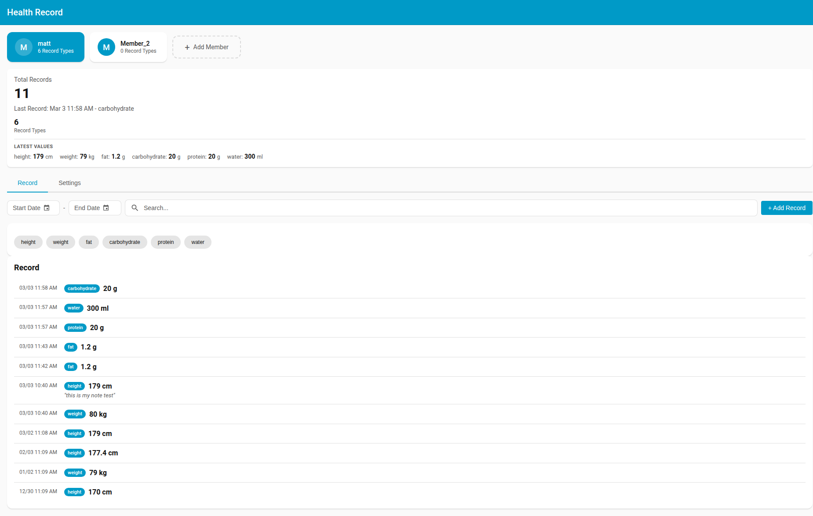
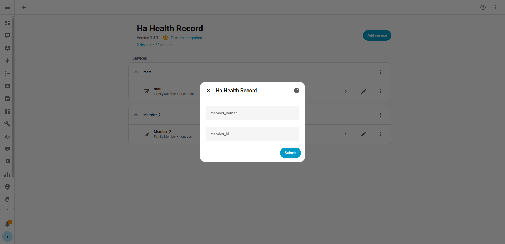
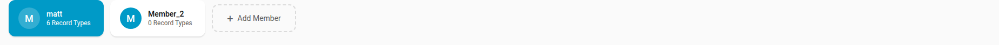
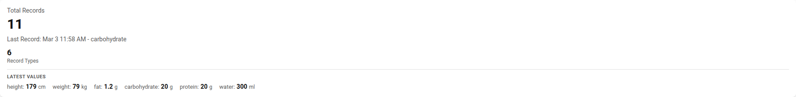
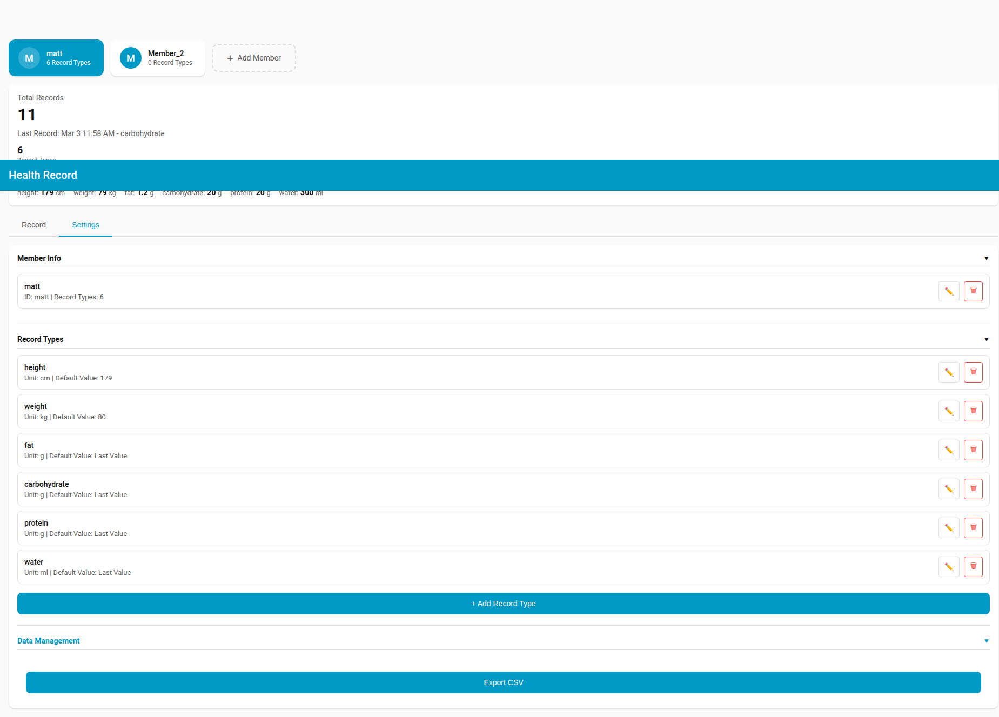
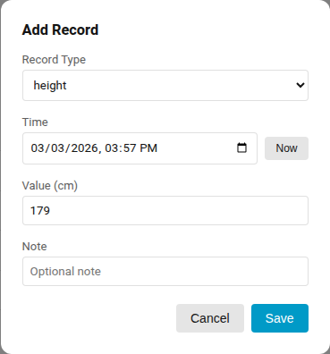

# Ha Health Record

[](https://github.com/hacs/integration)
[](https://www.home-assistant.io/)
[](LICENSE)
[](https://github.com/oaoomg/ha_health_record/releases)

[English](README.md) | **繁體中文**

一個用於追蹤家庭成員健康紀錄的 Home Assistant 自訂整合。透過專屬側邊欄面板，管理餵食、睡眠、體重、身高及自訂紀錄類型，支援完整時間軸、篩選和即時編輯功能。



## 功能特色

- **多成員管理** - 為多位家庭成員獨立追蹤健康紀錄
- **彈性紀錄類型** - 內建類型（餵食、睡眠、體重、身高）加上無限自訂類型，可設定單位和預設數值
- **專屬側邊欄面板** - 完整功能的 UI，支援日期篩選、搜尋、類型切換、即時編輯和紀錄時間軸
- **Home Assistant 實體** - 每個紀錄類型會建立 sensor、number、button 和 text 實體，原生整合 HA
- **事件驅動自動化** - 觸發 `ha_health_record_record_logged` 事件，可用於自動化
- **CSV 匯出** - 將成員的所有紀錄匯出為 CSV 檔案
- **多語言支援** - 支援英文、繁體中文、簡體中文
- **完全本地** - 所有資料儲存在 Home Assistant 本地，無雲端依賴

## 安裝方式

### HACS（建議）

1. 在 Home Assistant 中開啟 HACS
2. 點擊右上角的三點選單
3. 選擇 **自訂儲存庫**
4. 輸入儲存庫網址：`https://github.com/oaoomg/ha_health_record`
5. 選擇類別：**Integration**
6. 點擊 **新增**，然後在 HACS 整合列表中找到「Ha Health Record」並點擊 **下載**
7. 重新啟動 Home Assistant

### 手動安裝

1. 從 [GitHub Releases](https://github.com/oaoomg/ha_health_record/releases) 下載最新版本
2. 將 `custom_components/ha_health_record` 資料夾複製到 Home Assistant 的 `config/custom_components/` 目錄：
   ```
   config/
   └── custom_components/
       └── ha_health_record/
           ├── __init__.py
           ├── manifest.json
           ├── config_flow.py
           ├── coordinator.py
           ├── const.py
           ├── sensor.py
           ├── number.py
           ├── button.py
           ├── text.py
           ├── panel.py
           └── frontend/
               ├── ha-health-record-panel.js
               └── sidebar-title.js
   ```
3. 重新啟動 Home Assistant

## 設定

### 新增第一位成員

1. 前往 **設定** > **裝置與服務**
2. 點擊 **+ 新增整合**
3. 搜尋 **Ha Health Record**
4. 輸入成員名稱（例如「寶寶小明」），可選填自訂 ID
5. 點擊 **送出**



整合會自動建立預設紀錄類型（餵食、睡眠、體重、身高）和側邊欄面板項目。

### 新增更多成員

對每位家庭成員重複上述設定流程。每位成員會有各自獨立的裝置、實體和資料儲存。

### 管理紀錄類型

紀錄類型可在側邊欄面板的 **設定** 分頁中新增、編輯或刪除。每個紀錄類型包含：
- **名稱** - 顯示名稱（例如「餵食」）
- **單位** - 測量單位（例如「ml」、「kg」、「cm」）
- **預設數值** - 固定值或「上次數值」模式，方便快速輸入

## 面板 UI

### 成員切換

在面板標題列切換家庭成員，或直接新增成員。



### 成員總覽

一覽總紀錄數、最新紀錄時間、紀錄類型數量及最新數值。



### 紀錄分頁

瀏覽完整紀錄時間軸，支援日期範圍篩選、文字搜尋和紀錄類型切換。點擊任一紀錄可展開編輯或刪除。


### 設定分頁

管理成員資訊、紀錄類型（新增/編輯/刪除），以及將資料匯出為 CSV。



### 新增紀錄對話框

選擇類型、設定時間、輸入數值，並可選填備註來記錄新的健康紀錄。



## 實體

整合會為每位成員的每個紀錄類型建立 4 個實體：

| 實體類型 | 實體 ID 格式 | 說明 |
|---------|-------------|------|
| **Sensor** | `sensor.<成員>_<類型>_record` | 最新紀錄數值，包含時間戳和備註屬性 |
| **Number** | `number.<成員>_<類型>_value` | 設定數值以記錄新紀錄 |
| **Button** | `button.<成員>_<類型>_log` | 按下以使用目前的 number 數值記錄 |
| **Text** | `text.<成員>_<類型>_note` | 設定下一筆紀錄的備註 |

### 實體 ID 範例

以成員「baby_emma」的紀錄類型「weight」為例：
- `sensor.baby_emma_weight_record` - 顯示最新體重數值
- `number.baby_emma_weight_value` - 設定體重數值
- `button.baby_emma_weight_log` - 記錄體重紀錄
- `text.baby_emma_weight_note` - 設定體重紀錄備註

### Sensor 屬性

每個 sensor 實體提供以下屬性：
- `last_value` - 最近一次紀錄的數值
- `last_timestamp` - 最後紀錄的 ISO 時間戳
- `last_note` - 最後紀錄的備註（如有）
- `record_count` - 此類型的總紀錄數

### 不使用面板記錄紀錄

您可以純粹透過 HA 實體來記錄紀錄：

1. 設定數值：`number.baby_emma_weight_value` = `3.5`
2. （選填）設定備註：`text.baby_emma_weight_note` = `"餵食後"`
3. 按下按鈕：`button.baby_emma_weight_log`

## 事件與自動化

### 事件：`ha_health_record_record_logged`

每次記錄紀錄時觸發（無論透過面板或實體）。

| 欄位 | 說明 |
|------|------|
| `member_id` | 成員識別碼（例如 `baby_emma`） |
| `member_name` | 成員顯示名稱（例如 `Baby Emma`） |
| `record_type` | 紀錄類型 ID（例如 `weight`） |
| `value` | 紀錄數值 |
| `unit` | 測量單位 |
| `note` | 選填備註文字 |
| `timestamp` | 紀錄的 ISO 時間戳 |

### 自動化範例

**紀錄時發送通知：**

```yaml
automation:
  - alias: "健康紀錄通知"
    trigger:
      - platform: event
        event_type: ha_health_record_record_logged
    action:
      - service: notify.mobile_app
        data:
          title: "健康紀錄"
          message: >
            {{ trigger.event.data.member_name }}:
            {{ trigger.event.data.record_type }} =
            {{ trigger.event.data.value }} {{ trigger.event.data.unit }}
```

**使用計數器追蹤每日餵食次數：**

```yaml
automation:
  - alias: "計算每日餵食次數"
    trigger:
      - platform: event
        event_type: ha_health_record_record_logged
        event_data:
          record_type: feeding
    action:
      - service: counter.increment
        target:
          entity_id: counter.daily_feedings
```

## 疑難排解

### 側邊欄顯示錯誤語言

側邊欄面板標題會自動偵測您的 Home Assistant 語言設定。如果標題顯示錯誤語言，請嘗試：
1. 前往個人資料設定確認語言設定
2. 重新整理瀏覽器頁面

### 紀錄類型未顯示

在設定分頁新增或修改紀錄類型後，實體會在下次整合重新載入時建立。前往 **設定** > **裝置與服務** > **Ha Health Record** > 點擊成員的三點選單 > **重新載入**。

### 資料儲存在哪裡？

所有健康紀錄資料以 JSON 檔案格式儲存在 Home Assistant 的 `.storage` 目錄中，每位成員一個檔案（例如 `.storage/ha_health_record_baby_emma`）。資料在重啟和更新後會保留。

### 有紀錄數量限制嗎？

沒有硬性限制。系統使用高效的 JSON 儲存機制，搭配延遲儲存來批次處理操作。效能已在每位成員數千筆紀錄的規模下測試過。

### 如何匯出資料？

前往側邊欄面板 > 選擇成員 > **設定** 分頁 > 展開 **資料管理** > 點擊 **匯出 CSV**。這會將選定成員的所有紀錄下載為 CSV 檔案。

### 如何移除成員？

前往 **設定** > **裝置與服務** > **Ha Health Record** > 點擊成員設定項目的三點選單 > **刪除**。這會移除該成員、所有相關實體和儲存的資料。

## 授權條款

本專案採用 [GNU 通用公共授權條款第 3 版](LICENSE) 授權。
